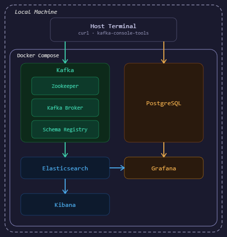

# Kafka + Kibana + PostgreSQL

A fully local data pipeline built with Docker Compose. Events are streamed through Kafka into Elasticsearch for indexing and search, visualized via Kibana and Grafana. PostgreSQL handles relational data storage.

## Architecture



## Tech Stack

- **Apache Kafka** — event streaming backbone
  - **Schema Registry** — enforces Avro schema on Kafka messages
- **Elasticsearch** — search and log indexing engine
  - **Kibana** — visualization UI for Elasticsearch data
- **PostgreSQL** — relational database
- **Grafana** — monitoring dashboards (connects to Elasticsearch and PostgreSQL)
- **Docker Compose** — runs all services as containers locally

## Getting Started

> Requires Docker Desktop installed and running. Use Git Bash for curl commands — not PowerShell.

```bash
git clone https://github.com/firstname-lastname/kafka-kibana-postgresql
cd kafka-kibana-postgresql
docker compose up -d
```

> Verify all services are running:
```bash
docker compose ps
```

Once all services are running, open Kibana at `http://localhost:5601` and Grafana at `http://localhost:3000` to explore your data.

## Service Endpoints

| Service | URL |
|---|---|
| Kibana | http://localhost:5601 |
| Elasticsearch | http://localhost:9200 |
| Grafana | http://localhost:3000 |
| Schema Registry | http://localhost:8081 |
| Kafka | localhost:9092 |
| PostgreSQL | localhost:5432 |

## Teardown

To stop all services and remove volumes:

```bash
docker compose down -v
```

> The `-v` flag removes volumes, clearing any stale Kafka and Zookeeper data between runs.

To remove all Docker images pulled for this project and reclaim disk space:

```bash
docker image prune -a
```

> This will display a "Total reclaimed space" message showing how much disk space was freed.
